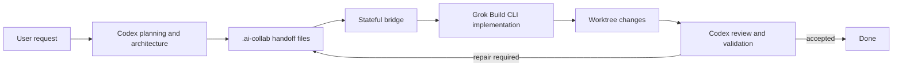

# Grok Build Codex

**English** | [简体中文](./README.zh-CN.md)

[](./LICENSE)
[](https://github.com/damian2848/grok-build-codex/releases)
[](https://github.com/damian2848/grok-build-codex/actions/workflows/test.yml)

A stateful Codex plugin that lets **Codex plan, design, review, and accept**, while the local **Grok Build CLI implements the code**.

The plugin creates a durable collaboration contract in the repository, delegates bounded implementation tasks to Grok, tracks foreground or background runs, resumes repair sessions, and returns control to Codex for independent diff review and validation.

## Workflow



## Features

- Keeps requirements, architecture, acceptance criteria, and review decisions owned by Codex.
- Shares durable context through `.ai-collab/` instead of relying on hidden model state.
- Optionally imports the current Codex JSONL transcript into a Grok session.
- Runs foreground or tracked background implementation jobs.
- Stores job state, logs, worker PID, Grok PID, output, and resumable Grok thread IDs.
- Supports `check`, `run`, `runs`, `show`, `stop`, `run-resume-candidate`, and `import`.
- Uses cancellation-first terminal-state handling so a late worker cannot overwrite `cancelled` with `completed`.
- Prevents delegated instructions from authorizing commits, pushes, branch switching, destructive Git commands, or credential edits.
- Supports macOS, Linux, and Windows with Node entry points, POSIX `.sh` wrappers, Windows `.cmd` wrappers, and `taskkill` process-tree cancellation.

## Requirements

- [Codex](https://github.com/openai/codex) with plugin support.
- Node.js `>= 18.18.0`.
- Git.
- A locally installed and authenticated Grok Build CLI.

Verify Grok before installing the plugin:

```console
grok --version
grok models
```

## Install from GitHub

Add this repository as a Codex plugin marketplace, then install the plugin:

```console
codex plugin marketplace add damian2848/grok-build-codex
codex plugin add grok-build-codex@grok-build-codex
```

Start a new Codex task after installation so the new skill is loaded.

To update later:

```console
codex plugin marketplace upgrade grok-build-codex
codex plugin add grok-build-codex@grok-build-codex
```

## Local Development Install

Clone the repository and add it as a local marketplace:

```console
git clone https://github.com/damian2848/grok-build-codex.git
cd grok-build-codex
codex plugin marketplace add .
codex plugin add grok-build-codex@grok-build-codex
```

## Use

Start a new Codex task and ask:

```text
Use $delegate-to-grok to plan this task, delegate implementation to Grok, and review the result.
```

Codex will inspect the repository, initialize `.ai-collab/`, write the plan and acceptance criteria, delegate a bounded task, inspect the resulting diff, run validation, and either accept the work or send a focused repair request back to the same Grok thread.

## Collaboration Files

| File | Owner | Purpose |
| --- | --- | --- |
| `.ai-collab/context.md` | Codex | Requirements, constraints, facts, decisions, and existing changes |
| `.ai-collab/plan.md` | Codex | Architecture and ordered implementation plan |
| `.ai-collab/task.md` | Codex | Current implementation or repair assignment |
| `.ai-collab/acceptance.md` | Codex | Observable acceptance criteria and validation commands |
| `.ai-collab/review.md` | Codex | Independent findings and repair requirements |
| `.ai-collab/state.json` | Codex | Workflow phase, iteration, job ID, and Grok thread ID |
| `.ai-collab/.bridge-data/` | Bridge | Ignored runtime state, locks, logs, PIDs, and stored output |

## Bridge Commands

Use the platform-independent Node entry point:

```console
node scripts/grok-bridge.mjs check --cwd /path/to/repository --json
node scripts/grok-bridge.mjs run --write --fresh --cwd /path/to/repository --prompt-file .ai-collab/task.md --json
node scripts/grok-bridge.mjs runs --cwd /path/to/repository --json
node scripts/grok-bridge.mjs show JOB_ID --cwd /path/to/repository --json
node scripts/grok-bridge.mjs stop JOB_ID --cwd /path/to/repository --json
node scripts/grok-bridge.mjs run-resume-candidate --cwd /path/to/repository --json
node scripts/grok-bridge.mjs import --cwd /path/to/repository --json
```

Convenience wrappers:

- macOS/Linux: `scripts/init-workspace.sh` and `scripts/run-grok.sh`
- Windows Command Prompt: `scripts/init-workspace.cmd` and `scripts/run-grok.cmd`
- All platforms: `scripts/init-workspace.mjs` and `scripts/run-grok.mjs`

## Configuration

| Environment variable | Purpose |
| --- | --- |
| `GROK_BINARY` | Override the Grok executable path |
| `GROK_BINARY_ARGS_JSON` | JSON string array of fixed arguments prepended without shell interpolation |
| `GROK_CODEX_DATA` | Override the bridge runtime-state directory |
| `CODEX_THREAD_ID` | Associates bridge jobs with the current Codex task |
| `CODEX_TRANSCRIPT_PATH` | Explicit Codex JSONL transcript path when automatic discovery fails |

## Safety Model

The plugin deliberately separates implementation from acceptance:

1. Codex owns architecture and scope.
2. Grok edits only within the task packet.
3. Grok may not commit, push, rebase, reset, clean, restore, switch branches, or edit credentials.
4. Codex independently inspects the diff and runs validation.
5. Only Codex may mark the task accepted.

Do not put API keys, tokens, cookies, credential files, private system prompts, or chain-of-thought in `.ai-collab/` or transcript imports.

## Development

```console
npm test
node --check scripts/grok-bridge.mjs
```

The test suite includes cross-platform Node entry points and simulated Windows coverage for command execution, process-tree cancellation, and state-file replacement. GitHub Actions runs the suite on Linux, macOS, and Windows.

## Attribution

The stateful bridge runtime is adapted from xAI's Apache-2.0 licensed [`xai-org/grok-build-plugin-cc`](https://github.com/xai-org/grok-build-plugin-cc), version `0.2.0`, commit `5a9f924a8d1ca802b3e6dc0ce0e1a602fb35ec9e`.

See [LICENSE](./LICENSE), [NOTICE](./NOTICE), and [THIRD_PARTY.md](./THIRD_PARTY.md).

## KaiyunCode

Need a convenient AI API relay for development and agent workflows? Visit **[KaiyunCode.com](https://kaiyuncode.com/)** for a unified API access experience covering popular text and multimodal models, with developer-friendly integration options.
