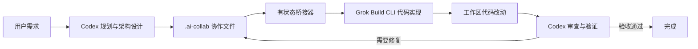

# Grok Build Codex

[English](./README.md) | **简体中文**

[](./LICENSE)
[](https://github.com/damian2848/grok-build-codex/releases)
[](https://github.com/damian2848/grok-build-codex/actions/workflows/test.yml)

一个有状态的 Codex 插件，让 **Codex 负责需求规划、架构设计、代码审查和最终验收**，由本地 **Grok Build CLI 负责代码落地**。

插件会在仓库内建立持久化的协作协议，把边界明确的实现任务交给 Grok，跟踪前台或后台任务，续接修复会话，最后将控制权交还 Codex，由 Codex 独立检查代码差异并运行验证。

## 工作流程



## 功能特性

- 需求、架构、验收标准和审查结论始终由 Codex 管理。
- 通过 `.ai-collab/` 共享持久化上下文，不依赖模型之间不可见的隐藏状态。
- 可选导入当前 Codex JSONL 会话记录到 Grok 会话。
- 支持前台执行和可追踪的后台实现任务。
- 保存任务状态、日志、桥接器 PID、Grok PID、输出内容和可恢复的 Grok 线程 ID。
- 支持 `check`、`run`、`runs`、`show`、`stop`、`run-resume-candidate` 和 `import`。
- 取消操作优先锁定终态，避免延迟结束的进程把 `cancelled` 覆盖成 `completed`。
- 委派任务不会授权 Grok 提交、推送、切换分支、执行破坏性 Git 命令或修改凭据。
- 支持 macOS、Linux 和 Windows，包含 Node 入口、POSIX `.sh` 包装器、Windows `.cmd` 包装器以及 `taskkill` 进程树终止。

## 环境要求

- 支持插件的 [Codex](https://github.com/openai/codex)。
- Node.js `>= 18.18.0`。
- Git。
- 已在本机安装并完成认证的 Grok Build CLI。

安装插件前先验证 Grok：

```console
grok --version
grok models
```

## 从 GitHub 安装

将本仓库添加为 Codex 插件市场，然后安装插件：

```console
codex plugin marketplace add damian2848/grok-build-codex
codex plugin add grok-build-codex@grok-build-codex
```

安装后请新建一个 Codex 任务，让新 Skill 被正确加载。

后续更新：

```console
codex plugin marketplace upgrade grok-build-codex
codex plugin add grok-build-codex@grok-build-codex
```

## 本地开发安装

克隆仓库并添加为本地插件市场：

```console
git clone https://github.com/damian2848/grok-build-codex.git
cd grok-build-codex
codex plugin marketplace add .
codex plugin add grok-build-codex@grok-build-codex
```

## 使用方式

新建一个 Codex 任务，然后输入：

```text
使用 $delegate-to-grok 规划这个任务，把代码实现交给 Grok，完成后审查改动并验收。
```

Codex 会检查仓库、初始化 `.ai-collab/`、编写计划与验收标准、委派边界明确的任务、检查 Grok 生成的代码差异、运行验证，并决定验收或将聚焦的修复任务发回同一个 Grok 线程。

## 协作文件

| 文件 | 所有者 | 用途 |
| --- | --- | --- |
| `.ai-collab/context.md` | Codex | 需求、约束、事实、决策和已有改动 |
| `.ai-collab/plan.md` | Codex | 架构设计和有序实施计划 |
| `.ai-collab/task.md` | Codex | 当前实现或修复任务 |
| `.ai-collab/acceptance.md` | Codex | 可观察的验收标准和验证命令 |
| `.ai-collab/review.md` | Codex | 独立审查发现和修复要求 |
| `.ai-collab/state.json` | Codex | 工作流阶段、迭代次数、任务 ID 和 Grok 线程 ID |
| `.ai-collab/.bridge-data/` | 桥接器 | 被忽略的运行状态、锁、日志、PID 和保存的输出 |

## 桥接命令

推荐使用跨平台 Node 入口：

```console
node scripts/grok-bridge.mjs check --cwd /path/to/repository --json
node scripts/grok-bridge.mjs run --write --fresh --cwd /path/to/repository --prompt-file .ai-collab/task.md --json
node scripts/grok-bridge.mjs runs --cwd /path/to/repository --json
node scripts/grok-bridge.mjs show JOB_ID --cwd /path/to/repository --json
node scripts/grok-bridge.mjs stop JOB_ID --cwd /path/to/repository --json
node scripts/grok-bridge.mjs run-resume-candidate --cwd /path/to/repository --json
node scripts/grok-bridge.mjs import --cwd /path/to/repository --json
```

便捷包装器：

- macOS/Linux：`scripts/init-workspace.sh` 和 `scripts/run-grok.sh`
- Windows 命令提示符：`scripts/init-workspace.cmd` 和 `scripts/run-grok.cmd`
- 全平台：`scripts/init-workspace.mjs` 和 `scripts/run-grok.mjs`

## 配置项

| 环境变量 | 用途 |
| --- | --- |
| `GROK_BINARY` | 覆盖 Grok 可执行文件路径 |
| `GROK_BINARY_ARGS_JSON` | 以 JSON 字符串数组形式配置固定前置参数，不经过 Shell 插值 |
| `GROK_CODEX_DATA` | 覆盖桥接器运行状态目录 |
| `CODEX_THREAD_ID` | 将桥接任务关联到当前 Codex 任务 |
| `CODEX_TRANSCRIPT_PATH` | 自动查找失败时显式指定 Codex JSONL 会话路径 |

## 安全模型

插件刻意将代码实现和最终验收分离：

1. Codex 管理架构和任务边界。
2. Grok 只能在任务包指定的范围内修改代码。
3. Grok 不得提交、推送、变基、重置、清理、恢复、切换分支或修改凭据。
4. Codex 独立检查差异并运行验证。
5. 只有 Codex 可以将任务标记为验收通过。

不要把 API Key、Token、Cookie、凭据文件、私有系统提示词或思维链写入 `.ai-collab/` 或会话导入内容。

## 开发与测试

```console
npm test
node --check scripts/grok-bridge.mjs
```

测试包含跨平台 Node 入口，以及针对 Windows 命令执行、进程树终止和状态文件替换的模拟覆盖。GitHub Actions 会在 Linux、macOS 和 Windows 上运行测试。

## 上游归属

有状态桥接运行时改编自 xAI 以 Apache-2.0 开源的 [`xai-org/grok-build-plugin-cc`](https://github.com/xai-org/grok-build-plugin-cc)，对应版本 `0.2.0`、提交 `5a9f924a8d1ca802b3e6dc0ce0e1a602fb35ec9e`。

详见 [LICENSE](./LICENSE)、[NOTICE](./NOTICE) 和 [THIRD_PARTY.md](./THIRD_PARTY.md)。

## KaiyunCode

如果你需要便捷的 AI API 中转服务来支持开发和智能体工作流，欢迎访问 **[KaiyunCode.com](https://kaiyuncode.com/)**。平台提供热门文本与多模态模型的统一 API 接入体验，并提供面向开发者的便捷集成方式。
